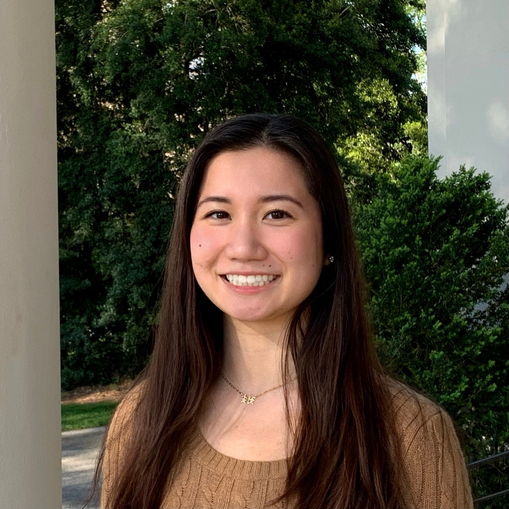

## Angela Y. Cao

Hi, I am a senior at [Emory](https://www.emory.edu/home/index.html) pursuing a B.A. in Linguistics and Math. I am also completing an unofficial major in Quantitative Sciences with a concentration in English Literature. 
 
"What do you mean?" simplifies my research interests nicely. I am interested in (a) the discrepancies between what we say and what we mean, (b) formal representations of meaning, and (c) how we can improve upon these to include the nuances that make language uniquely ours. 
 
### Highlights
Currently, I am completing an honors thesis advised by Dr. Jinho Choi.

Aug. 2021: I completed an NSF REU hosted by Stanford CSLI and was advised by Dr. Thomas Icard.

June 2021: Advised by Dr. Yun Kim and Dr. Lelia Glass, Maddy Liotta and I submitted [Question Formation in Tigrinya](https://drive.google.com/file/d/1CjIVF7P3aDVZexulMvr-3tlgQO8SytCr/view?usp=sharing) to TURJ of Georgia Tech. 

May 2021: Advised by Dr. Yun Kim, Haohan Shi and I presented [On the Relation Between NPIs and Processing Scalar Implicatures of Quantity](https://drive.google.com/file/d/1lgw34D1AqlsYHxPxJe9ojvsxvGk1_cv4/view?usp=sharing) at Emory's UG Research Symposium.

April/May 2021: Advised by Dr. Yun Kim, Maddy Liotta and I presented [Negative Polarity Items and Their Licensing in Tigrinya](https://drive.google.com/file/d/1jfHJvg0JcP6qMtwYPtcO8l6E0jqpg6Ab/view?usp=sharing) at NCUR 2021 and Emory's Linguistics Conference.

May 2020: I co-authored [Examining the Effects of Social Distancing Policies on COVID-19 Spread Using the Differential SIRD Model](https://drive.google.com/file/d/1HlWks3EADh73vDiWw-wdhAjWTi2i6ZhB/view?usp=sharing), which garnered honors from Emory University's MatheMatics Association (EUMMA).

### Contact
My email is firstname.middlename.lastname@emory.edu (my middle name is Yuan). Please feel free to reach out for a copy of my CV or any other reason. I enjoy receiving emails :)

